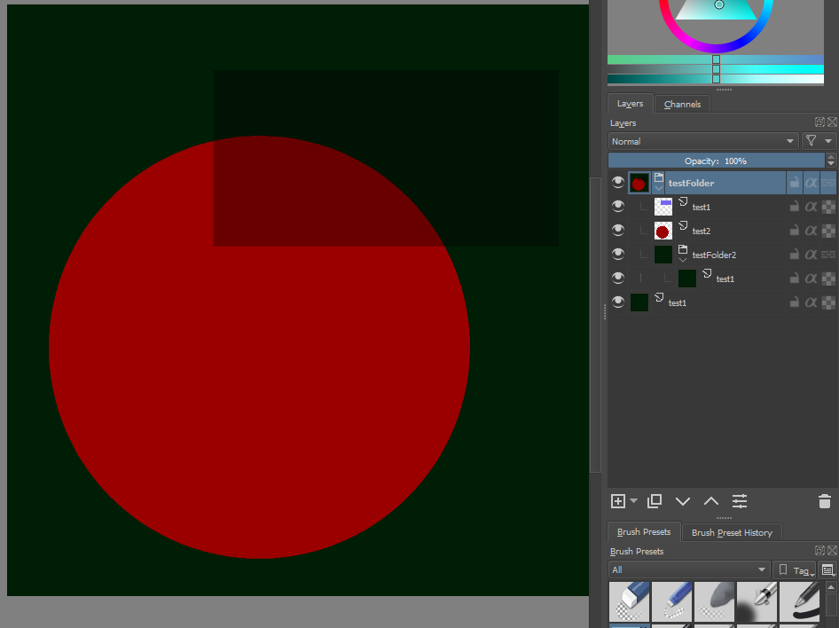

# OraCreator


Usage example
```C#

            List<Bitmap> list = new List<Bitmap>();
            list.Add(new Bitmap("img0.png"));
            list.Add(new Bitmap("img1.png"));
            list.Add(new Bitmap("img2.png"));

            var openRaster = new Openraster(
                new LayerFolder("testFolder",
                    new Layer(list[1], "test1",Composite.Multiply,Visibility.Visible,0.6),
                    new Layer(list[2], "test2"),
                    new LayerFolder("testFolder2",Composite.Multiply,
                        new Layer(list[0], "test1"))),
                new Layer(list[0], "test1")
            );

            openRaster.Save(@"output.ora");

```

Result




### Stuff used to make this:

 * [www.freedesktop.org](https://www.freedesktop.org/wiki/Specifications/OpenRaster/) Specifications/ OpenRaster

